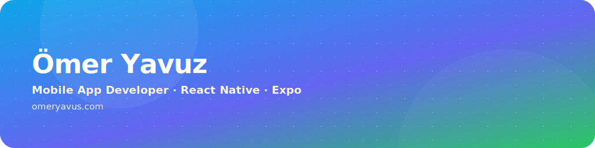

  

  
  
  

Aktif olarak Flutter ve React Native/Expo ile mobil uygulamalar geliştiriyorum.

## Web Sitesi

## Projeler

- [mucizemesaj](https://github.com/omeryavuscode/mucizemesaj) — Mucize, ezan vakitleri, kıble bulucu ve takvim ekranları içeren Expo uygulaması.
- [timelessmind](https://github.com/omeryavuscode/timelessmind) — Expo tabanlı bir mobil uygulama.
- [basketball-shot](https://github.com/omeryavuscode/basketball-shot) — Expo tabanlı bir mobil uygulama.
- [rows](https://github.com/omeryavuscode/rows) — Expo tabanlı bir mobil uygulama.

## Teknolojiler

  

## GitHub İstatistikleri

  
  

